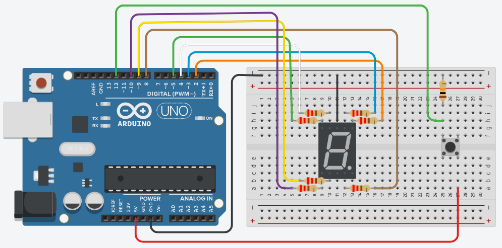

## Sobre
Gerador de letras para o jogo Stop.

## Materiais para o projeto
* 1 Arduino UNO
* 1 Protoboard
* 1 Display 7 segmentos 1 dígito
* 7 Resistores 220R
* 1 Push button
* 1 Resistor 10K (marrom-preto-laranja)
* 11 jumpers macho-macho

## Esquema do projeto

## Tinkercad
https://www.tinkercad.com/things/2vTtO2LwYUo?sharecode=WMCW9HKwazcl8FCxLDB0vgK0S2XTjDmCBZVVijnJ-so

## Licença
Este projeto está sob licença do MIT. Para mais detalhes, ver o arquivo LICENSE.
